# Actual System Architecture & UML Model Specification
## Plagiarism & AI Detection System (Detector Pro)

> [!NOTE]
> This document details the exact, concrete software architecture, database schema, module relationships, and execution sequences as implemented in your codebase. It provides both **Mermaid** and **PlantUML** notations for all diagrams, allowing you to easily view, render, and maintain them.

---

## 1. System Architecture Component Diagram
The system follows a lightweight, single-server FastAPI architecture that hosts both the REST API endpoints and serves the static frontend assets. It persists data to a local SQLite database and caches uploaded files and generated reports on disk.

### Mermaid Diagram
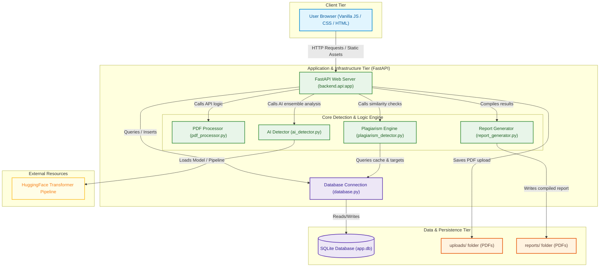

### PlantUML Notation
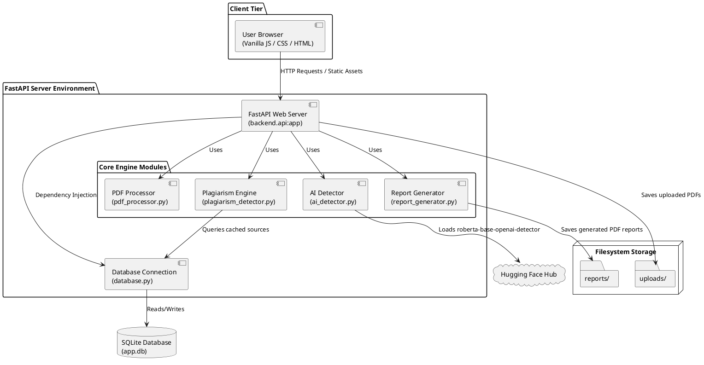

---

## 2. Module & Class Diagram
This diagram represents the actual Python functions, class definitions, structures, and schemas defined in your code, including backend modules, Pydantic schemas, and their relationship with the database connection and global variables.

### Mermaid Diagram
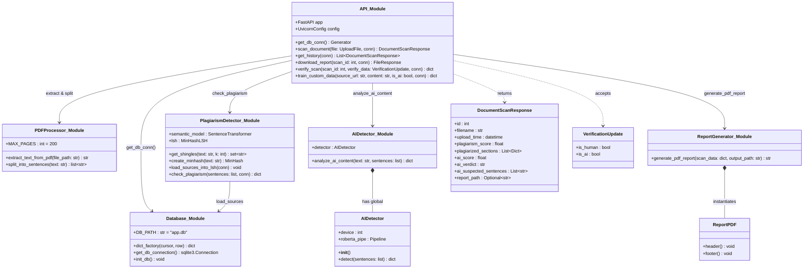

### PlantUML Notation
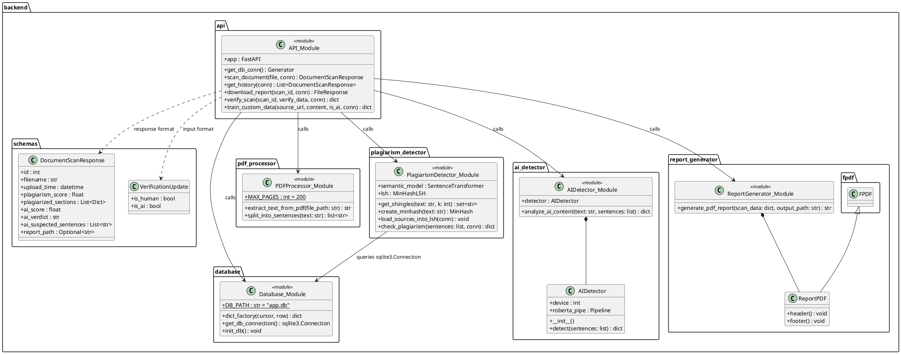

---

## 3. Sequence Diagram: Document Upload & Scanning Pipeline
This sequence diagram maps the exact runtime execution flow triggered when a user drops or selects a PDF file in the user interface. It follows the execution path through `app.js` → `api.py` → all backend engines → SQLite database → FPDF generation → DOM updates.

### Mermaid Diagram
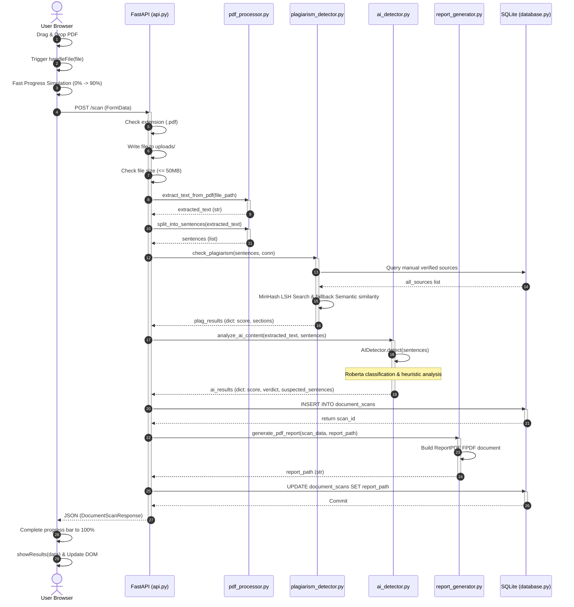

### PlantUML Notation
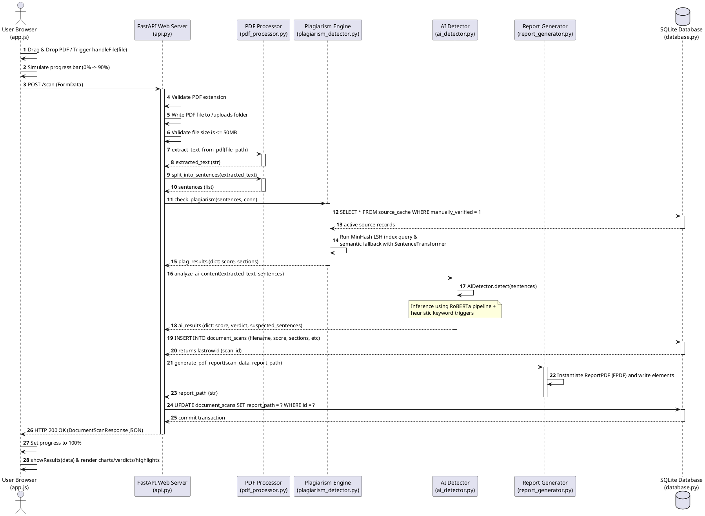

---

## 4. Database Entity-Relationship (ER) Diagram
This represents the structure of your local SQLite database (`app.db`) as initialized by `backend/database.py`. It shows every data field, its exact data type, default values, and primary/unique keys.

### Mermaid Diagram
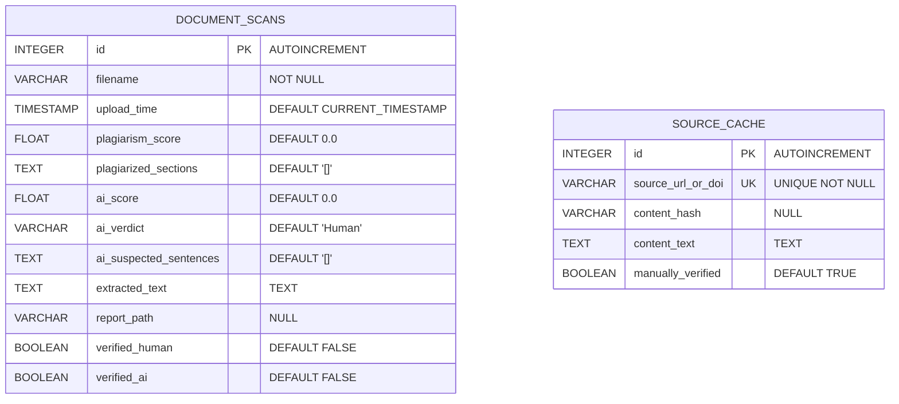

### PlantUML Notation
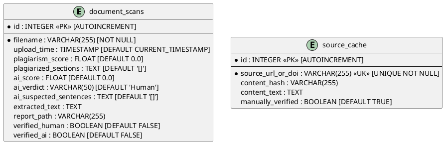

---

## 5. Activity Diagram: Processing Algorithmic Flow
This shows the step-by-step logic and decision forks executed within the `/scan` endpoint, showing how input validation, parallel extraction checks, the two-stage similarity process, the ensemble AI verification, database commits, and PDF compilations are controlled.

### Mermaid Diagram
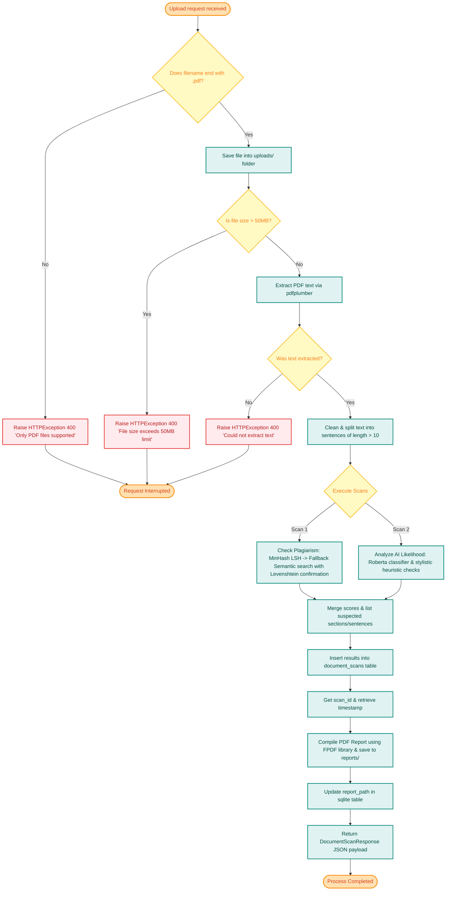

### PlantUML Notation
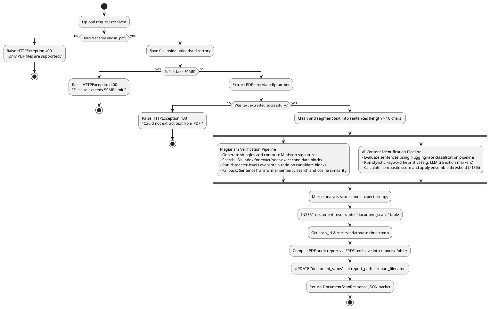

---

## 6. State Machine Diagram: Document Scan Lifecycle
This diagram models the lifecycle stages of a single scanned document record from upload, analysis processing, verification state updates by academic review, and final presentation state.

### Mermaid Diagram
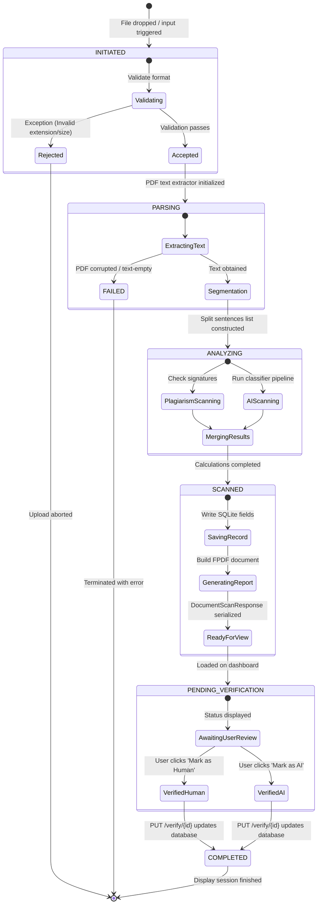

### PlantUML Notation
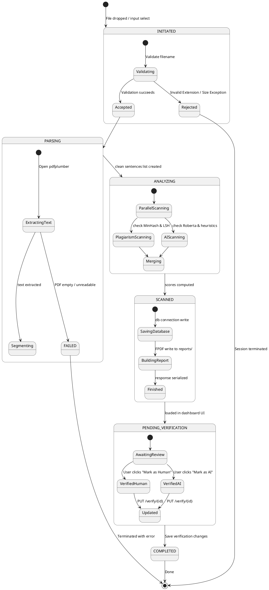

---
*UML Diagrams and System Architectural Model completed for Detector Pro.*
