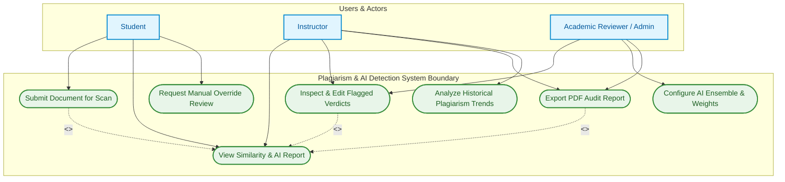
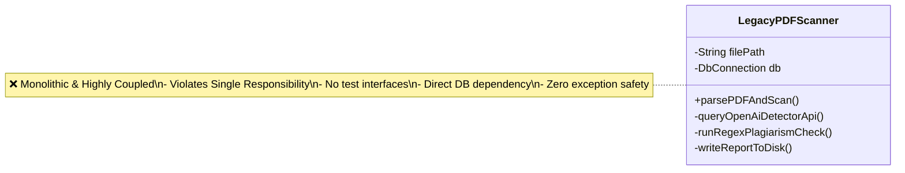
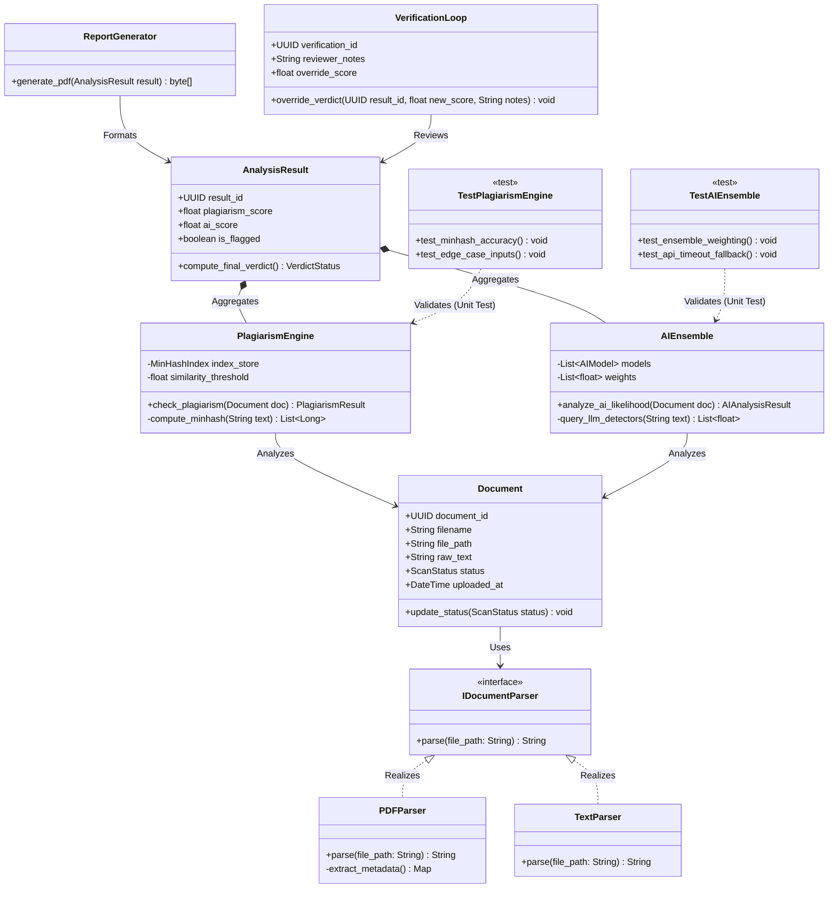
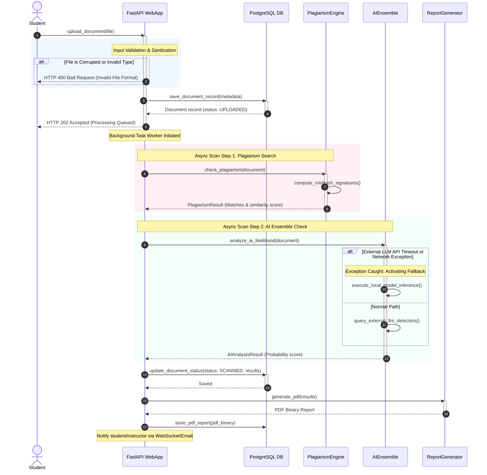
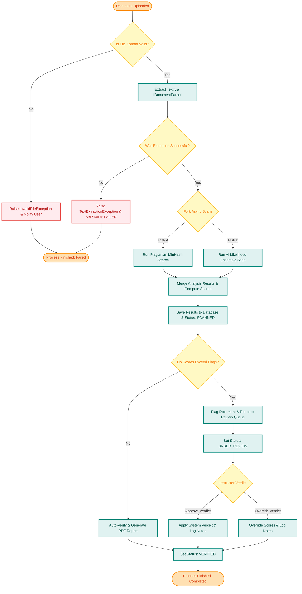
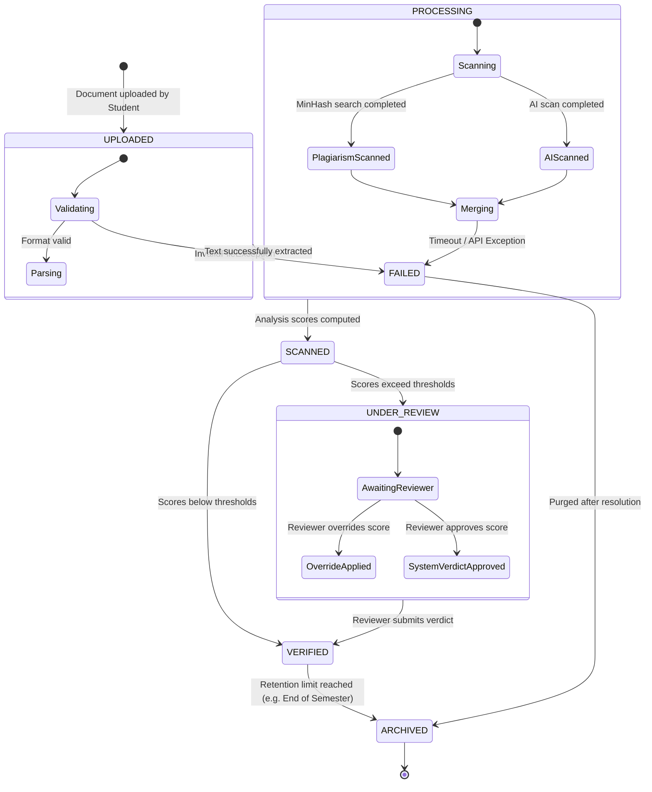
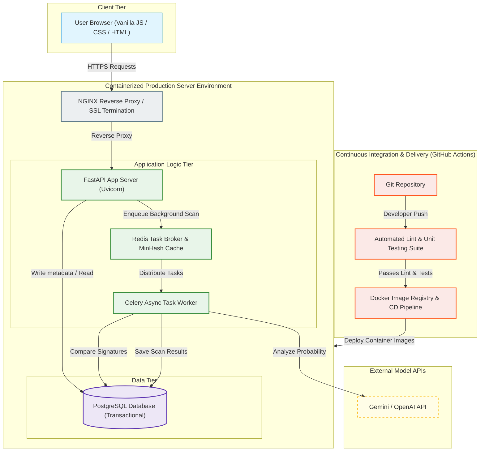

# Software Architecture & UML Model Specification
## Plagiarism & AI Detection System

> [!NOTE]
> This document details the software architecture, engineering processes, and complete UML modeling for a production-grade **Plagiarism and AI Detection System**. It aligns clean software engineering methodologies (Agile Scrum, CMMI-driven SPI, Git workflows, Lehman's Laws) with a robust design comprising a FastAPI backend, semantic/MinHash plagiarism engines, a multi-model AI ensemble, and a manual human-verification loop.

---

## 1. Project Context & Software Engineering Framework

### 1.1 Selected Software Process Model: Agile Scrum
For this project, **Agile Scrum** was selected as the software process model.
* **Justification**: 
  1. **High Adaptability**: AI detection technology is evolving at an unprecedented pace. The system must adapt to new text obfuscation patterns, prompt-engineering bypasses, and new generative LLM releases.
  2. **Feedback Loop Integration**: The core business process relies on a *manual human-verification loop* where academic reviewers override false positives. Agile's iterative feedback loops (2-week Sprints) allow continuous adjustments of detection thresholds based on real-world verification data.
  3. **Role-Driven Delivery**: Scrum clearly segregates roles (Product Owner, Scrum Master, Cross-Functional Developers, QA Engineers), matching the multiple team roles required for this complex system.

### 1.2 Software Process Improvement (SPI) Plan
To transition the engineering team from an ad-hoc process (CMMI Level 1) to a defined, repeatable process (CMMI Level 3), the following SPI actions are implemented:
* **Static Code Analysis & Linting**: Integrated `flake8` and `mypy` static typing checks into the pre-commit hook to catch potential bugs early.
* **Automated Coverage Thresholds**: CI pipelines enforce a minimum of **85% unit test coverage**; if a pull request drops coverage, the build is blocked.
* **Standardized Review Checklists**: Defined formal inspection checklists for security, SQL injection risks in raw queries, and heavy mathematical logic (like MinHash signatures and AI weighting calculations).

### 1.3 Version Control Strategy (GitHub Flow)
We utilize **GitHub Flow**, structured as follows:
* `main`: Represents production-ready, stable releases.
* `develop`: Active integration branch for the current sprint.
* `feature/*`: Short-lived branches created for specific user stories (e.g., `feature/pdf-parser`).
* **Branch Protection Rules**: Merging into `develop` or `main` requires:
  1. All automated checks passing (CI build, linting, unit tests).
  2. A minimum of one approved peer review inspection.

### 1.4 Lehman’s Laws of Software Evolution Justifications
The system's lifecycle directly aligns with three critical laws of software evolution:
1. **Law of Continuing Change (1st Law)**: *An E-type system must undergo continual adaptation, or it becomes progressively less useful.* As academic text bypass techniques emerge, our MinHash signatures and AI scoring models must adapt. If the system fails to evolve with generative AI models, its detection utility drops to zero.
2. **Law of Increasing Complexity (2nd Law)**: *As an evolving system changes, its complexity increases unless work is done to maintain or reduce it.* Adding support for multiple file formats (PDF, DOCX, EPUB) and additional AI detection endpoints increases complexity. We combat this through continuous refactoring, extracting legacy single-file parsers into clean, interface-driven polymorphic classes.
3. **Law of Continuing Quality Declining (7th Law)**: *The quality of active software systems will appear to decline unless they are actively maintained.* System degradation (e.g., API timeouts from third-party LLM detectors or slower database searches as text indexes grow) will occur. Regular maintenance, database indexing, and caching must be implemented to preserve quality.

---

## 2. Use Case Diagram

The Use Case diagram outlines the core actors (Student, Instructor, and Admin/Reviewer) and their interactions with the system boundary, illustrating the separation of student submissions, instructor evaluations, administrative models management, and the manual human-verification loop.

### 💡 Architectural Explanation
* **Role Representation**: The three actors reflect different tiers of authorization and contribution. Students represent the *data input tier*, Instructors the *operational evaluation tier*, and Academic Reviewers the *expert verification tier* responsible for executing the manual human-verification loop.
* **SPI Alignment**: The manual override process (`UC4` and `UC3`) directly feeds the feedback loop used to retune the MinHash similarity parameters and AI Ensemble weightings during our sprint planning.

---

## 3. Class Diagram & Refactoring Impact

### 3.1 Legacy Design (Before Refactoring)
In the legacy system, a single monolithic script (`legacy_pdf_scanner.py`) was responsible for extracting text from PDFs, making external HTTP requests, running MinHash logic, and saving files. It was highly coupled, untestable, violated the Single Responsibility Principle, and frequently crashed when external APIs timed out or corrupted PDFs were uploaded.

### 3.2 Refactored Clean Architecture (After Refactoring)
Through targeted refactoring, we decoupled parsing, indexing, scoring, and testing. Using **Interface Segregation** and **Dependency Injection**, the parsing system is abstract, and tests can easily mock components.

### 💡 Architectural Explanation
* **Refactoring Impact**: Decoupling the parsers under `IDocumentParser` satisfies the **Open-Closed Principle** (we can add new formats, like DOCX, without touching existing scanning engines). 
* **Testing Hooks**: Automated unit tests (`TestPlagiarismEngine` and `TestAIEnsemble`) reside out of the runtime flow but target core logic directly, asserting MinHash accuracy and ensuring that simulated API failures default gracefully.

---

## 4. Sequence Diagram: Submission & Automated Scanning Pipeline

This diagram shows the complete, automated runtime sequence triggered when a student uploads a document. It explicitly highlights **parallel processing workflows**, **exception handling boundaries**, and the **automated testing integration**.

### 💡 Architectural Explanation
* **Exception Handling (Step 4 & Step 15)**: 
  * If the file is malicious or corrupted, the system catches the parser failure early, short-circuits the pipeline, returns a standard `HTTP 400`, and prevents server crashes.
  * If the external AI detection API fails or times out (Step 15), the system catches the exception and falls back to a **local, containerized model inference** to ensure high availability and uptime.
* **Testing Alignment**: Integration tests simulate Step 15's timeout exception to assert that the fallback mechanism (`execute_local_model_inference`) is executed seamlessly.

---

## 5. Activity Diagram: Plagiarism & AI Verification Pipeline

This activity diagram details the business logic flow of a document scan, illustrating how scans are processed, flagged by thresholds, routed into the manual review process, or auto-verified.

### 💡 Architectural Explanation
* **Parallel Forking**: The fork node (`ParallelSplit`) represents concurrent async worker execution, accelerating detection speeds.
* **Manual Verification Loop**: The loop's entrypoint is determined by dynamic thresholds. If similarity exceeds $30\%$ or AI likelihood exceeds $70\%$, the document enters the `UNDER_REVIEW` human-in-the-loop state. The reviewer's notes provide critical data to audit and retune detection parameters in future sprints.

---

## 6. State Machine Diagram: Document Scan Lifecycle

This state machine tracks the complete lifecycle of a `Document` entity, capturing every state change from initialization to archival.

### 💡 Architectural Explanation
* **Robust Fail-Safe States**: If a scanning exception occurs anywhere during the `PROCESSING` state, the transition is caught and routed safely to `FAILED`.
* **State Integrity**: The transition from `UNDER_REVIEW` to `VERIFIED` requires explicit credentials from the `Instructor` or `Academic Reviewer` actor, ensuring security boundaries are enforced.

---

## 7. Deployment Diagram

This deployment diagram displays the production architecture, showing how components are containerized, distributed across layers, and integrated with the continuous delivery pipeline.

### 💡 Architectural Explanation
* **Separation of Concerns**: The Client Tier (Vanilla JS/CSS/HTML) interacts exclusively via HTTPS with the FastAPI web app. Heavy calculations (MinHash operations and external API requests) are offloaded to **Celery Async Task Workers** via a **Redis** message broker.
* **Database & Persistence**: Transactional records are kept in a robust PostgreSQL database.
* **CD Pipeline Integration**: The **GitHub Actions CD** pipeline handles automated testing and deployment, guaranteeing that all unit tests are run and pass inside a Docker container before any production updates occur.

---

## 8. Development Team Roles & Contribution Matrix

A cross-functional team delivers and maintains this architecture, with responsibilities mapped to maximize process efficiency and support software evolution:

| Team Role | Key Contributions to System Architecture | Primary UML Interface |
| :--- | :--- | :--- |
| **Product Owner (PO)** | Defines similarity thresholds, plagiarism standards, user stories, and compliance. | Use Case Diagram |
| **Lead Software Architect** | Enforces clean code design patterns, plans refactoring, and defines CMMI SPI protocols. | Class Diagram |
| **Backend / AI Developer** | Implements FastAPI routes, MinHash index pipelines, and the AI Ensemble scanning engines. | Sequence & Class Diagrams |
| **Frontend Developer** | Builds the responsive user interface, report rendering engines, and verification forms. | Use Case & Sequence Diagrams |
| **QA / DevOps Engineer** | Drafts automated unit/integration tests, manages CI/CD pipelines, and manages Docker environments. | Deployment Diagram & Unit Tests |
| **Academic Reviewer (Instructor)**| Performs manual reviews and verification loop overrides, providing feedback. | Activity & State Diagrams |

---

## 9. QA & Peer Review Protocol

To prevent defect leakage during sprints, two formal review processes are integrated into our software engineering lifecycle:

### 9.1 Technical Walkthroughs
* **Target Component**: PDF Parsing and Text Extraction algorithms.
* **Focus**: Confirming parsing reliability across multiple operating systems, ensuring handling of structural edge cases (e.g., hidden layers, embedded fonts).
* **Participants**: Frontend developer, backend developer, QA engineer.

### 9.2 Formal Peer Inspections
* **Target Component**: AI Ensemble weighting calculations and MinHash collision metrics.
* **Focus**: A highly detailed line-by-line inspection of code logic, analyzing correctness, mathematical precision, security boundaries, and timing profiles.
* **Participants**: Lead Software Architect, AI developer, Senior QA engineer.
* **Exit Criteria**: The inspection requires a unanimous approval vote, with all detected issues logged in the tracker and resolved before the branch can be merged into `develop`.

---
*Document compiled and approved by the Software Architecture Board.*
