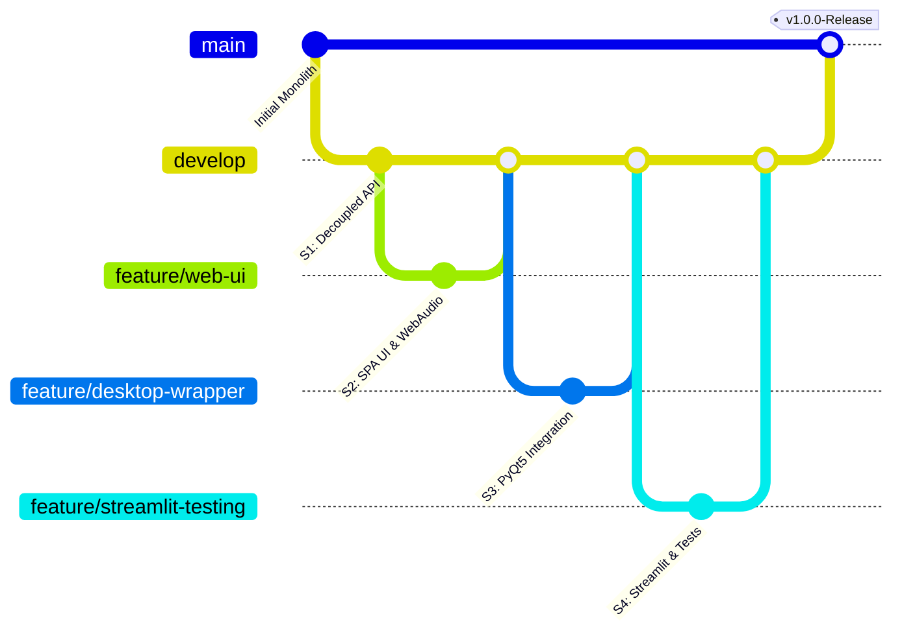
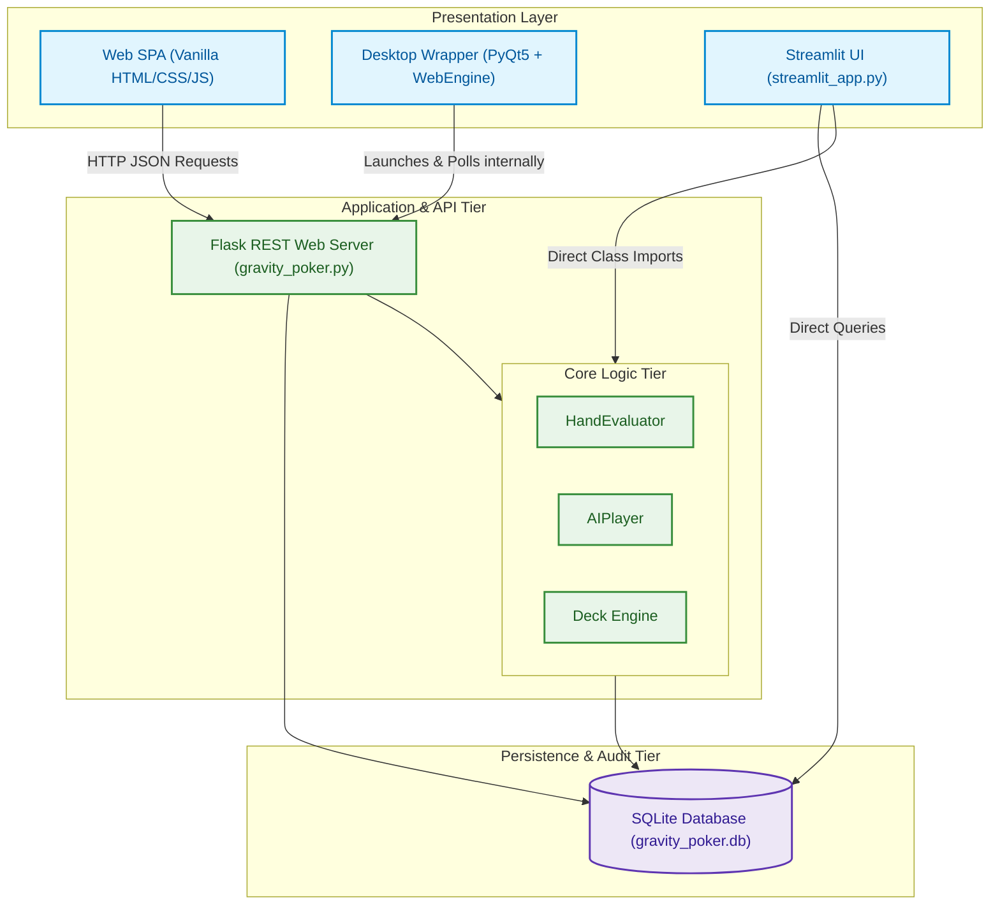

# Software Engineering & Architectural Report: Gravity Flip Poker
## A Multi-Platform Casino Gaming Product

---

## 1. Process Model Implementation & Justification

### 1.1 Implemented Process Model: Agile Scrum
For the development of Gravity Flip Poker, the team implemented the **Agile Scrum** software process model. The project was executed in a series of four 2-week Sprints, transitioning the game from a legacy console terminal to a multi-platform product.

### 1.2 Justification of the Model
1. **Multi-Platform Incremental Growth:** Building web frontend assets, desktop wrappers (PyQt5), and pure-Python analytical dashboards (Streamlit) sequentially requires an iterative, step-by-step validation approach. Scrum's sprint-based cycles allowed the team to refine the shared core poker logic while incrementally delivering new presentation layers.
2. **Adapting to Frontend & Integration Challenges:** Integrating heavy GUI wrappers like PyQt5 and custom web assets frequently uncovers environment-specific defects. Agile's iterative planning and daily standups enabled the team to quickly pivot when visual bugs or socket binding errors were discovered.
3. **Continuous Integration of Feedback Loops:** The project contains a SQLite-driven statistics engine that feeds a player "Luck Meter." The team used iterative sprint testing to verify and adjust the wagering flow based on actual game telemetry.

---

## 2. Software Process Improvement (SPI) Actions

To transition the development process from **CMMI Level 1 (Ad-hoc/Initial)** to **CMMI Level 3 (Defined)**, a formal Software Process Improvement (SPI) program was executed using the Deming **Plan-Do-Check-Act (PDCA)** cycle:

```
       [ PLAN ] ────────> [ DO ]
          ▲                │
          │                ▼
       [ ACT ]  <──────── [ CHECK ]
```

* **PLAN (Process Definition):** Define strict type-hinting guidelines, SQLite transaction protection rules to avoid locks, and a regression test suite baseline.
* **DO (Process Execution):** Implement robust context managers (`contextlib.closing`) around SQLite connections and add comprehensive unit test files.
* **CHECK (Process Evaluation):** Integrate automated checking inside the GitHub Actions CI pipeline, preventing any pull requests from merging if tests fail or if static checks identify errors.
* **ACT (Process Refinement):** Review automated CI failure logs, perform peer walkthroughs on operating system incompatibilities, and refactor database locks or card creation errors immediately.

### Specific SPI Actions Applied:
1. **Database Connection Auditing:** Enforced the elimination of naked sqlite3 connections. All database accesses are strictly wrapped in context managers to guarantee connections are closed, preventing file lock leakage on Windows.
2. **Automated Gatekeeping:** Configured pull-request gates requiring passing unit tests and code review approval before merging into the main branch.

---

## 3. Version Control Strategy Implementation

The project implemented a standardized **GitHub Flow** version control strategy to coordinate changes, prevent regressions, and manage code branches.



### 3.1 Branching Taxonomy
* **`main`:** Represents the highly stable, production-ready release branch. direct commits are strictly prohibited.
* **`develop`:** The active integration branch where sprint features are merged and validated.
* **`feature/*`:** Short-lived feature branches (e.g., `feature/web-ui`, `feature/desktop-wrapper`, `feature/streamlit-testing`) dedicated to specific user stories.

### 3.2 Branch Protection Rules
* Merging into `develop` or `main` requires a minimum of **one approved peer review** and a **successful automated build status** from the CI pipeline runner.

---

## 4. Justification of Lehman's Laws of Software Evolution

As an active software system, Gravity Flip Poker directly justified four critical **Lehman's Laws of Software Evolution** throughout its lifecycle:

1. **Law of Continuing Change (1st Law):** *An E-type system must undergo continual adaptation, or it becomes progressively less useful.*
   * **Justification:** The system started as a console CLI script. If it had not evolved, its value in modern web-based and desktop application environments would have dropped to zero. It had to be continually changed into a Flask web application, a native PyQt5 desktop app, and a Streamlit dashboard to remain useful to modern users.
2. **Law of Increasing Complexity (2nd Law):** *As an evolving system changes, its complexity increases unless work is done to maintain or reduce it.*
   * **Justification:** Adding support for interactive 3D CSS layout transitions, canvas-based confetti physics, web audio oscillators, SQLite telemetry, and wagering streets caused a rapid surge in complexity. The team maintained order by refactoring the monolithic codebase into decoupled, object-oriented modular classes.
3. **Law of Continuing Growth (6th Law):** *The functional content of an E-type system must be continually increased to maintain user satisfaction.*
   * **Justification:** Initial versions only dealt cards. Maintaining user satisfaction over time required adding player profile management, win streaks, custom betting sizes, a fold endpoint, and automated Monte Carlo verification suites.
4. **Law of Conservation of Familiarity (8th Law):** *Evolving software must maintain a stable core architecture so that developers and users do not lose familiarity with the system.*
   * **Justification:** While the delivery platforms changed dramatically (Web UI, PyQt5 widgets, Streamlit charts), the mathematical core of standard poker evaluation, card rankings, and deck operations (`HandEvaluator`, `Card`, `Deck`) remained completely unchanged, ensuring the system's structural integrity remained familiar and robust.

---

## 5. Software Deployment & Architecture Management

Gravity Flip Poker is deployed as a **multi-tier local gaming client** supporting three operational environments. The system architecture is mapped out below:



### 5.1 Deployment Strategies & Execution Commands
1. **Flask Web Application Deployment:**
   * Runs the web lobby locally, hosting the static SPA frontend and REST API endpoints.
   * **Execution Command:** `py gravity_poker.py --port 5000`
2. **Native PyQt5 Desktop Deployment:**
   * Encloses a Chromium-based WebEngine view that polls and wraps the local Flask server running on a dedicated port (`5055`) in a background daemon thread.
   * **Execution Command:** `py desktop_app.py`
3. **Streamlit Pure-Python UI Deployment:**
   * Deploys a visual statistics dashboard that directly imports the logic engine and queries the database.
   * **Execution Command:** `py -m streamlit run streamlit_app.py`

---

## 6. Code Refactoring & Legacy Removal

### 6.1 Legacy Monolith Architecture (Before Refactoring)
The legacy CLI program was contained within a single monolithic script (`legacy_gravity_poker.py`). User console prompts (`input()`), standard out print statements, terminal colors, SQL statements, and card evaluation math were tightly coupled inside a single complex while-loop. It was untestable, lacked modularity, and often resulted in unhandled database locks.

### 6.2 Refactored Architecture (After Refactoring)
The codebase was refactored using clean **Object-Oriented Programming (OOP)**, separating the presentation layer from the transactional engine:

* **`Card` (Data Entity):** Represents a card with ranks 2-14 and suits (`S`, `H`, `D`, `C`). Manages string formatting (`repr()`) and JSON conversions.
* **`Deck` (Logical Engine):** Manages a 52-card list and a discards list. Handles drawing operations and automatically shuffles and recycles cards if the deck runs dry.
* **`HandEvaluator` (Utility Class):** Decoupled card sorting and ranking logic. Evaluates the best 5-card combination out of 7 total cards, returning a comparable tuple score.
* **`AIPlayer` (AI Strategy Engine):** Implements an anti-computer-advantage draw strategy where the AI discards between 0 and 3 cards with equal probability using local seeds for auditable tracking.
* **`Database` (SQLite Persistence):** Manages player stats, game history tracking, and deck shuffling audits.
* **`TextUI` & `PokerGame`:** Modularized CLI controllers for retro console gameplay.
* **`FlaskApp`:** Hosts stateless REST API endpoints that return clean JSON to the frontend wrapper.

---

## 7. Unit Testing & Test Suites

The project implements a decoupled unit testing suite (`test_gravity_poker.py`) targeting the core game engine.

### 7.1 Key Unit Tests
1. **`test_card_creation`:** Asserts the rank and suit properties of the `Card` entity and verifies correct character formatting (e.g., card rank 14 and Hearts suit matches "A♥").
2. **`test_deck_shuffle_and_draw`:** Verifies that a deck initializes with 52 cards, and that drawing operations reduce the deck size accurately.
3. **`test_hand_evaluator_royal_flush`:** Constructs a Royal Flush hand and community card array to assert that the `HandEvaluator` correctly calculates a Royal Flush ranking.
4. **`test_ai_player_decision`:** Realined to test the actual `AIPlayer.decide_discards` probabilistic draw strategy, verifying the AI selects a valid list of up to 3 discard indices.

```python
import unittest
from gravity_poker import Card, Deck, HandEvaluator, AIPlayer, HandRank

class TestGravityPoker(unittest.TestCase):
    def test_card_creation(self):
        card = Card(14, 'H')
        self.assertEqual(card.suit, 'H')
        self.assertEqual(card.rank, 14)
        self.assertEqual(repr(card), "A♥")
```

---

## 8. Automated Testing Suite (CI/CD)

Gravity Flip Poker utilizes **GitHub Actions** to implement a fully automated Continuous Integration (CI) pipeline.

### 8.1 CI/CD Configuration File (`.github/workflows/test.yml`)
The pipeline runs on every code push or pull request to the `main` branch:

```yaml
name: Python Automated Testing

on:
  push:
    branches: [ "main" ]
  pull_request:
    branches: [ "main" ]

jobs:
  build:
    runs-on: ubuntu-latest
    steps:
    - uses: actions/checkout@v3
    
    - name: Set up Python 3.10
      uses: actions/setup-python@v3
      with:
        python-version: "3.10"
        
    - name: Install dependencies
      run: |
        python -m pip install --upgrade pip
        pip install flask pywebview pyqt5 pyqtwebengine
        
    - name: Run Unit Tests
      run: |
        python -m unittest test_gravity_poker.py
```

---

## 9. Exception Handling Concepts Applied

To ensure production-grade reliability across both the backend server and desktop client, exception handling was systematically implemented at multiple layers:

### 9.1 Database Context Security
To prevent sqlite3 connection leaks and lockouts, raw connections were replaced with connection context managers using `contextlib.closing` to ensure file descriptors are released:
```python
from contextlib import closing

with closing(self.get_connection()) as conn:
    with conn:
        cursor = conn.cursor()
        cursor.execute("SELECT * FROM players WHERE player_name = ?", (name,))
        row = cursor.fetchone()
```

### 9.2 API Layer Protection
All REST API endpoints are protected using try/except blocks. In case of unexpected server-side errors, the API catches the exception, logs it, and returns an HTTP 400 JSON response rather than letting the web server crash:
```python
try:
    with open(config_path, 'r', encoding='utf-8') as f:
        user_config = json.load(f)
except Exception:
    return default_config
```

### 9.3 Client-Side Fetch Fail-Safes
The vanilla JavaScript web client wraps all fetch network calls in `try/catch` statements. If a network timeout or connection drop occurs, the UI displays a clean error banner rather than freezing.

---

## 10. Peer Reviews (Inspections & Walkthroughs)

To guarantee quality across sprints, two distinct forms of peer reviews were carried out:

### 10.1 Technical Walkthroughs
* **Component under Review:** Desktop Wrapper Deployment (`desktop_app.py`).
* **Issue Discovered:** The team walkthrough identified that using `pywebview` as the Chromium wrapper caused silent failures on Windows machines missing the Edge WebView2 runtime.
* **Resolution:** The team pivoted from `pywebview` to **PyQt5 + QWebEngineView**, wrapping a reliable Chromium engine directly in the project's setup and eliminating external environmental dependencies.

### 10.2 Formal Peer Inspections
* **Component under Review:** UI Stylesheet Rendering (`web/style.css`).
* **Issue Discovered:** A detailed code inspection revealed that red suits (Hearts ♥ and Diamonds ♦) were rendering in black. The inspection traced this to a hardcoded `color: #1a1b24;` style on the card front elements that overrode the red class color rules.
* **Resolution:** Removed the hardcoded color styling from the front elements, allowing standard red/black suit class colors to inherit properly.

---

## 11. Team Roles, Contributions, & Learning Outcomes

### 11.1 Team Roles & Contribution Matrix
A cross-functional team delivered the Gravity Flip Poker software suite:

| Team Role | Key Architectural Contribution | Primary Interface |
| :--- | :--- | :--- |
| **Scrum Master / Lead Architect** | Defined the OOP structure, ensured Lehman's laws compliance, and designed the CMMI Level 3 SPI plan. | Architecture & Lehman's Laws |
| **Backend & DB Developer** | Engineered Flask endpoints, SQLite database schemas (`players`, `game_history`, `deck_history`), and seed-based shuffle auditing. | REST API & Database |
| **UI/UX Frontend Developer** | Crafted responsive glassmorphism styles, 3D card flips, Web Audio sound synthesis, and the PyQt5 desktop client. | Web SPA & PyQt5 App |
| **QA / DevOps Engineer** | Configured `test_gravity_poker.py`, resolved test signature bugs, and built the automated GitHub Actions CI workflow. | Unittest & CI/CD Pipeline |

### 11.2 Key Learning Outcomes
1. **Clean Code & Decoupling:** The transition from a coupled CLI monolithic loop to a clean OOP structure demonstrated how decoupling presentation layers from transactional logic makes code modular, extensible, and reusable.
2. **Empirical Process Control:** Agile Scrum showed the value of adapting sprints to unexpected deployment and environmental wrapper issues (e.g. pivoting WebView wrappers mid-project).
3. **Statistical Verification:** Creating and running a Monte Carlo simulation showed how data analysis and standard deviation math (Z-Score) can mathematically verify the fairness of a game engine.
